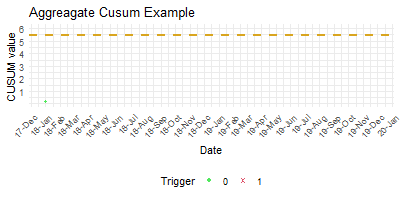

```{r setup, include=FALSE}
library(ragg)
library(RefManageR)
BibOptions(check.entries = FALSE, bib.style = "authoryear", style = "markdown",
           dashed = TRUE, cite.style="authoryear", longnamesfirst=FALSE)

#file.name <- system.file("Bib", "", package = "RefManageR")
bib <- ReadBib("References.bib")

options(htmltools.dir.version = FALSE)
knitr::opts_chunk$set(
  fig.width=9, fig.height=3.5, fig.retina=3,
  out.width = "100%",
  cache = FALSE,
  echo = TRUE,
  message = FALSE, 
  warning = FALSE,
  hiline = TRUE,
  dev = "ragg_png"
)
```

```{r xaringan-themer, include=FALSE, warning=FALSE}
library(xaringanthemer)
# google_font("Open Sans")
# style_duo(primary_color = "#1F4257"
#           , secondary_color = "#F97B64"
#           , text_font_family = "Open Sans"
#           , title_slide_background_image = "./assets/img/artsy.png"
#           , title_slide_background_position = "right 15% bottom 50%"
#           , title_slide_background_size = "30%"
#           )
# title_slide_background_position
# title_slide_image("https://github.com/chrismainey/Mainard/tree/master/assets/images/icon.png")
# style_duo_accent(
#   primary_color = "#1381B0",
#   secondary_color = "#FF961C",
#   inverse_header_color = "#FFFFFF"
# )
```

class: title-slide

# Chief Analyst Interview

<br><br>

### Examples of previous analytical projects


<br><br><br><br><br>

###   Dr Chris Mainey

`r icons::icon_style(icons::fontawesome("twitter"), fill = "#005EB8")` [@chrismainey](https://twitter.com/chrismainey)
`r icons::icon_style(icons::fontawesome("github"), fill = "#005EB8")` [chrismainey](https://github.com/chrismainey)
`r icons::icon_style(icons::fontawesome("linkedin"), fill = "#005EB8")`  [chrismainey](https://www.linkedin.com/in/chrismainey/)
`r icons::icon_style(icons::fontawesome("orcid"), fill = "#005EB8")` [0000-0002-3018-6171](https://orcid.org/0000-0002-3018-6171)
`r icons::icon_style(icons::fontawesome("globe"), fill = "#005EB8")` [www.mainard.co.uk](https://www.mainard.co.uk)

.footnote[Presentation and code available: **https://github.com/chrismainey/chief_analyst_presentation**]

.art_cap[R generative art - inspired by Antonio Sánchez Chinchón - @aschinchon]


???

Say hi - introduce myself

As you've no doubt seen from my application, I'm Patient Safety Lead - System Analysis and Delivery with NHS England and Improvement.

Thanks for the opportunity to present, and interview with you today.
As the brief was to present two projects that demonstrate technical skill.  I'm committed to using modern techniques, and embracing open source approaches, so I've taken the liberty to build the presentation itself in R, and the code used for visualisations etc. is available along with it on GitHub.
**Go to next slide before saying more about background!!!**


---
## Overview

+ Senior Data Scientist / Analyst in NHS, led data science and analyst teams

+ PhD in Applied Statistics and Machine Learning

+ Experience of most areas of NHS, clinical trials, research and public health

+ Senior fellow NHS-R community, and visible analytical leader in NHS


+ Keen to further the 'Analyst Revolution'

--

### Two examples of my work:

+ Developing analytical tools for NHS incident reporting data

+ Re-imagining standardised mortality ratio (SMR) surveillance


???

I'm aiming to illustrate to problems that I was tackling, give concise summaries of the approaches, highlighting the methods and tool sets used.

---
class: inverse center middle

# Developing analytical tools for NHS incident reporting data


---
## Analysing Incident Data

+ My PhD Project: `r Citep(bib, "maineyStatisticalMethodsNHS2020")` [thesis available here](https://discovery.ucl.ac.uk/id/eprint/10094736/)

+ Patient Safety movement in England has encourage national incident reporting (NRLS)
 + Route in scandals like Mid Staffs and Bristol
 + Harvard Medical Practice study `r Cite(bib, "leapeNatureAdverseEvents1991", .opts = list(max.names=2))`, 'Too Err is Human' `r Citep(bib, "kohnErrHumanBuilding2000", .opts = list(max.names=2))`, 'An organisation with a memory' `r Citep(bib, "donaldsonOrganisationMemory2002", .opts = list(max.names=2))`

--

+ Desire to compare behaviour across organisations despite this
  + Little use in most quantitative measures of incident reporting
  + Change over time?

--

+ Elephant in the room: main signal is free-text:
  + Clinical review
  + NLP / text mining
  
--

### HED wanted an NRLS 'module' for comparing trusts / survellieance

---
## Project overview

.left-column[
+ __"Ground-clearing" exercise - Literature review__

  + Strengthened view on free-text signal
  + Data completeness a huge issue
  + Little-to-no useful parameters in dataset
  + No obvious orthogonal outcome
  + Reporting is highly organisation-specific
  

  
+ __Only quantitative approach is 'counting'__
  + Created a 'panel' dataset - per organisation, per month
  + Other predictors from HES: APC, OP & AE
  + Multi-level model assumption due to clustering
  + Overdispersion modelled various ways
]

--

.right-column[
+ __Output approaches__
  + Adjusted z-score
  + Funnel plot for cross sectional comparison
  + RA-cusum control charts for change over-time
  
+ __Natural Language Processing__
  + Tokenisation and processing of reports
  + Bag-of-words model
  + Visualisation with 'wordclouds'
  + Predictive modelling of harm level from text (83% accuracy)
]

???

To quote Andi's, 'it doesn't get more exciting than a systemtic literature search,' but this was the place to start.
Deeply challenging review, as it was an ill-defined question: 'how has NRLS been used for analysis?'


---
## Analytical methods (1)

### Data preparation
+ `SQL` Server (ETL) - required manual `SAS` correction for delimiting
+ Creation of calendar table, join all tables and aggregate at per month, per trust.

--

### Predictors / Feature Engineering

+ Predictors examined as raw counts, and proportions, as well as 'offset' denominators
+ Functional forms examined - multi-collinearity, and splines for time.

--

### Regression based models:

+ Poisson regression `r Citep(bib, "poissonRecherchesProbabiliteJugements1837")` (`R`) as basis, in `R`
+ Mixture/compound distribution models `r Citep(bib, "sellersFlexibleRegressionModel2010")`


???

+ Had to start all the way back with how do we get extracts, as NRLS is not static.  Needed system to chose mose recent updated.

+ Problems with delimiters - required diagnosing and manual SAS process

+ ETL and warehousing

+ Extraction into reporting tables as 'counts per day'
 + HES isn't per day, it's episodes.  So per day, is a spell happening?
 + Investigated different methods of bed-day calculation, depending on which you chose, you can call day cases zero time in hospital.

---

## Analytical methods (2)

.pull-left[

Overdispersion, where conditional variance is greater than conditional mean, occurs when:

1. Aggregation / Discretization
1. Mis-specified predictors/model
1. Presence of outliers
1. Variation between response probabilities (heterogeneity)

__Repeated measures (correlation) __


]

.pull-right[

]


???

+ The big issue here is overdispersion.  For distributions with fixed variance assumption (Poisson and Binomial), there isn't room in the mathematical definition for anything other than perfect.

+ That is to say that, the model assumes it's a perfect fit, and it's not. Mainly from:

---

## Analytical methods (3)

###Advances on Poisson regression

+ Generalized Additive Models (GAM) `r Citep(bib, "woodGeneralizedAdditiveModels2006")` - smoothed functions of predictors
+ Tree methods: trees, boosting, bagging & Random Forests `r Citep(bib, c("breimanBaggingPredictors1996", "friedmanStochasticGradientBoosting2002", "breimanRandomForests2001"))`
+ Neural Networks `r Citep(bib, "hastieElementsStatisticalLearning2009")`

### Use of models

+ Indirectly standardised ratio
+ Cross-sectional comparison :
  + Overdispersion adjusted z-scores `r Citep(bib, "spiegelhalterHandlingOverdispersionPerformance2005")`
  + Funnel plots `r Citep(bib, "spiegelhalterFunnelPlotsComparing2005")`
+ Longitudinal
  + Control charting  `r Citep(bib, "woodallUseControlCharts2006")`

---

## Natural Language Processing (NLP)

Key that the free-text description contains real signal, but can't manually read ~500,000 per year


.pull-left[
+ Quantitative analysis of text

+ Text processing / preparation `tidytext`, `quanteda` 

+ Visualisation - wordclouds, TF-IDF

+ Topic Modelling - LDA `r Citep(bib, "bleiLatentDirichletAllocation2003", .opts = list(max.names=2))`

+ Using LDA predictions to predict harm level

+ __Class-imbalance__

]

.pull-right[
<p style="text-align:center;">

</P>
]

???

Statistical methods so far are interesting, but missing the major issue of the text.
The key issue here is that there are ~500,000 reports per year.
National Clinical review team of 3 -5 depending on project, so they focus on severe harm and death.
With routing research and other work, maybe a further 2% are systematically reviewed.
This means 98% are not reviewerd and, to my mind, 'begging' for some methods of finding a signal.

This is where text methods come in.


Class imbalance is the major issue here:  that is where there are different size classes (or groups) to predict.
As said before Severe and and Death account for >1%.
Naturally poorer at predicting these, but interesitng finding what that Random Forest methods performed better than others against class imbalance ~83% accuracy, and Naive Bayes performed well for minority classess by not majority.

---
## Outputs

+ HED interactive 'module' allowing - NHSEI prevented launch of this, but tehcniques now being built for NHSEI

+ Recommendations for modelling shared with organisations.
 + NHSD now investigating some of methods for SHMI.
 + NHSEI
 
+ Creation of `FunnelPlotR` R package, available on CRAN and donated to NHS-R community.


---
class: inverse center middle

# Re-imagining standardised mortality ratio (SMR) surveillance

---

## Re-imagining SMR surveillance


+ When comparing hospital mortality, it is common to adjust for "case-mix" to reduce confounding.

+ Organisation conflate 'excess' predicted deaths with 'preventable' deaths, and much academic debate


.pull-left[

+ Commonly measures are:
  + [Summary Hospital-level Mortality Indicator (SHMI)](https://digital.nhs.uk/data-and-information/publications/ci-hub/summary-hospital-level-mortality-indicator-shmi) `r Citep(bib, "campbellDevelopingSummaryHospital2012", .opts = list(max.names=2))`
  + [Dr Foster Hospital Standardised Mortality Ratio (HSMR)](https://www.nhs.uk/NHSEngland/Hospitalmortalityrates/Documents/090424%20MS%28H%29%20-%20NHS%20Choices%20HSMR%20Publication%20-%20Presentation%20-%20Annex%20C.pdf) `r Citep(bib, "jarmanExplainingDifferencesEnglish1999", .opts = list(max.names=2))`

+ Commonly make the cross-sectional comparisons with Funnel Plot

+ __Unanswered question:__
  + 'Is trust "X" getting worse'?

]

.pull-right[

```{r funnel, echo=FALSE, out.height=300, out.width=600, fig.height=4, fig.width=6, dpi=400, message=FALSE, warning=FALSE}
library(ragg)
library(COUNT)
library(FunnelPlotR)
library(dplyr)

data("medpar")

model1<- glm(died ~ los + age80 + factor(type), data=medpar, family="binomial")

# Add predictions and write to data base to test database queries
medpar$preds <- predict(model1, type="response")

mod_plot <-
  medpar %>%
  group_by(Organisation = factor(provnum)) %>%
  summarise(observed = sum(died),
            predicted = sum(preds)) 

fp1 <- funnel_plot(numerator=mod_plot$observed,denominator=mod_plot$predicted, 
            group = mod_plot$Organisation, limit=95
            ,label = "both"
            , sr_method = "SHMI"
            , title = "Example Funnel Plot"
            , draw_adjusted = FALSE
             )
plot(fp1)
```

]

???

First point:  reduces confounding, but sometimes increases bias and is at the expense of complexity.

---

## Monitoring SMRs over time

+ SMRs are generally cross-sectional, as they are single time-point calculations.

.pull-left[

### Risk-adjusted cusum charts

+ Many control chart methods, but need appropriate error structure
 + Risk-adjustment
 + CQC outliers programme  .footnote[1]
 + Dr Foster's cususm alerts 

+ Organisations don't understand it as a 'diagnostic test'

]

.pull-right[

<p style="text-align:center;">


</p>
]


???

For methods with more of a time dimension, one might consider forecasting of survival methods, in general.

Dr Foster Intelligence created an industry or 'alerting' trusts to risks - based on the methods they CQC 


The diagnostic test, the same in any machine learning prediction model, is essential.  In epidemiology and machine learning we might construct a 2x2 table, or confusion matrix, with our predictions v.s. truth.  Assess quality of model, but there are always some false positive and negatives.  There is a trade-off between 'sensitivity' and 'specificity':  You can catch more with a lower threshold, but you'll get more false positives.  Extreme of this is to treat every data point as positive.
This has resource implications - requiring clinical review and often highlighting data quality or statistical issues.


---

## Project overview

+ __Aim: Reduce confusion of users, and strike the balance between true and false positives__

--

+ Initially applied to HSMR:
  + SHMI commonly uses a 'VLAD' chart `r Citep(bib, "lovegroveMonitoringPerformanceCardiac1999", .opts = list(max.names=2))` , but control limits are CUSUMs. `r Citep(bib, "sherlaw-johnsonMethodDetectingRuns2005", .opts = list(max.names=2))`
  + SHMI planned for second phase (after I left UHB).
  

+ Unclear why there were difference control limits and methods.
  + Which was 'best'? and do the compare?
  
--

### Statistical and literature review process

+ Aggregation
+ Trigger limit
+ 'Window' size
+ __Both claimed false discovery rate (FDR) of 0.1%__

---

### Developing methods

.pull-left[
### CQC
+ Data are transformed to z-scores
+ Global trigger (5.48) - can convert average run-length to FDR, and set threshold `r Citep(bib, c("griggNullSteadystateDistribution2008", "carequalitycommissioncqcNHSAcuteHospitals2014"), .opts = list(max.names=2))`
+ Applicable to other indicators and groupings, subject to transformation
+ Tested in R, translated in `SQL` procedures for calculation against all trusts and diagnosis groups
]

.pull-right[
### DFI
+ Binomial assumption and false positives used to set threshold through simulation. `r Citep(bib,"bottlePredictingFalseAlarm2011", .opts = list(max.names=2))`
+ Intractable to calculate each month, and authors fitted a set of prediction equations.
+ Wrote program to solve for each trust/diagnosis group with non-linear optimiser (`R`)
+ Translated into similar `SQL` process, with call to `R`

]

<br>
### Other issues

+ Takes too long: Iterative - 'quirky update'.
+ Different aggregation has to be considered in design, and progress routes, through analytical tool.
+ Educate trusts on false-positive argument and build confidence.

---
class: references

### References (1)

```{r, results='asis', echo=FALSE}
PrintBibliography(bib, end = 15)
```

---
class: references

### References (2)

```{r, results='asis', echo=FALSE}
PrintBibliography(bib, start = 16)
```
